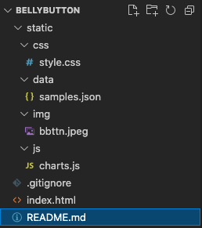
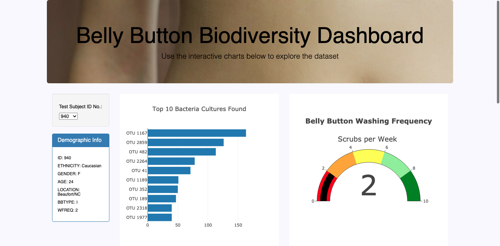
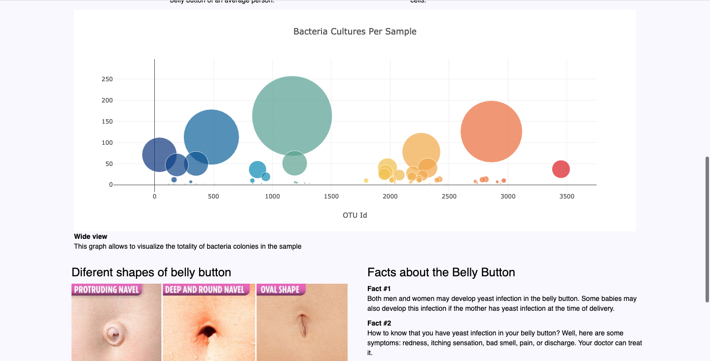
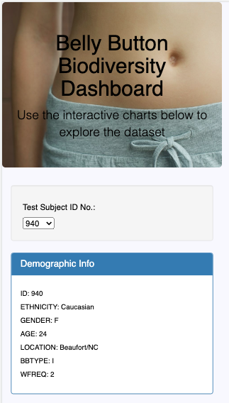
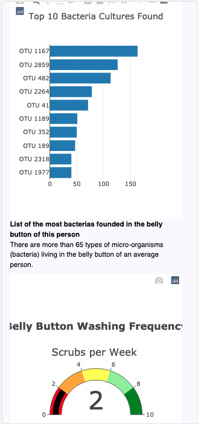

# Belly Button
###### Module 12. Bootcamp Javascrip
__________________________________

# Overview
It is requested to make some tables that show the results of an investigation on the amount of bacteria that live in the belly button.

JavaScript, plotly, html, css are used. To carry out the activity

- File structure.

# Results
A resposible page

- Desktop view.

- Mobile view.

# Summary

It is necessary to wash your belly button daily.